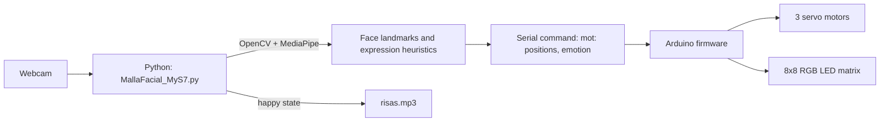

*This project was created as part of the Robotics II course by Christian Gómez.*

# Social Robot

Social Robot is an academic prototype of a three-degree-of-freedom social robot that uses a camera feed to detect facial landmarks, follow a face, imitate head movement, and present simple facial expressions. The Python application processes the webcam stream and sends motor positions and an expression code over serial communication to an Arduino sketch, which drives three servos and an 8×8 RGB LED matrix. When a happy expression is detected, the application can also play the included laughter audio.

## Main implementation

The most complete version is [`Codigo/MallaFacial_MyS7.py`](Codigo/MallaFacial_MyS7.py). It is the main entry point and integrates webcam capture, MediaPipe Face Mesh, movement tracking, expression heuristics, serial control, and audio playback.

`Codigo/CodigoAdafruitLEDMotor/CodigoAdafruitLEDMotor.ino` is its matching Arduino firmware: unlike the alternate `sketch_jun25a` sketch, it also controls the RGB LED facial display.

## Implemented features

- Captures video from the default camera with OpenCV at a requested 1280×720 resolution.
- Detects up to three faces using MediaPipe Face Mesh and selects the face nearest the image centre for tracking.
- Computes facial-landmark positions to centre the robot head on a detected face and imitate head movement.
- Classifies three display states through landmark-distance heuristics: normal, happy, and surprised.
- Sends commands as `mot:servo0,servo1,servo2,emotion` over a 9600-baud serial connection.
- Controls three servo positions and renders normal, happy, or surprised faces on a 64-pixel NeoPixel matrix through Arduino.
- Plays the bundled `risas.mp3` audio for the happy state.

## System architecture



## Technologies

- Python with OpenCV, MediaPipe, PySerial, Pygame, and Playsound.
- Arduino C++ using `Servo` and `Adafruit_NeoPixel` libraries.
- Webcam-based computer vision and serial communication.

## Repository layout

```text
.
├── Codigo/
│   ├── MallaFacial_MyS7.py                 # Main Python application
│   ├── moverServo.py                       # Empty placeholder
│   ├── CodigoAdafruitLEDMotor/
│   │   └── CodigoAdafruitLEDMotor.ino      # Servo + RGB matrix firmware
│   └── sketch_jun25a/
│       └── sketch_jun25a.ino               # Earlier servo-only firmware
├── moverServo.py                            # Standalone serial-control draft
├── risas.mp3                                # Audio asset used by the application
├── Informe Final de Robotica 2.pdf          # Project report
├── *.jpg                                    # Prototype photographs
└── *.mp4                                    # Demonstration videos
```

## Requirements

### Hardware

- A camera accessible to OpenCV (the application opens camera index `0`).
- An Arduino-compatible board connected by serial USB. The current code is configured for `COM8` at 9600 baud.
- Three servos connected to pins 11, 10, and 9, respectively, as defined in the main Arduino sketch.
- A 64-pixel RGB NeoPixel matrix connected to pin 3, as defined in `CodigoAdafruitLEDMotor.ino`.

The accompanying report identifies the physical prototype as a 3-DOF platform and documents the use of MG995 servos and an Arduino Mega 2560.

### Software

- Python 3 and the packages in `requirements.txt`.
- Arduino IDE with the `Servo` and `Adafruit_NeoPixel` libraries available.

## Installation and execution

1. Upload `Codigo/CodigoAdafruitLEDMotor/CodigoAdafruitLEDMotor.ino` to the connected Arduino board.
2. Install the Python dependencies from the repository root:

   ```bash
   python -m pip install -r requirements.txt
   ```

3. Update `COM8` in `Codigo/MallaFacial_MyS7.py` if the board uses a different serial port.
4. From the repository root, run:

   ```bash
   python Codigo/MallaFacial_MyS7.py
   ```

5. Press `Esc` in the video window to stop the application.

## Limitations

This is an academic prototype, not a production robot. Running it depends on the physical robot, camera, serial port, Arduino firmware, compatible Python packages, and the local audio asset. Emotion states are determined by simple landmark-distance thresholds rather than a trained emotion-recognition model, and their reliability depends on camera framing, lighting, and the physical calibration of the servos.

The existing Python script contains machine-specific paths and serial settings; these must be adapted to the execution environment. It also initializes hardware immediately, so it cannot be exercised fully without the connected devices.

## Author

Christian Gómez — Robotics II course project, developed with Enmanuel Capdevila.
